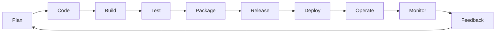

# Plan DevOps del Proyecto Móvil — Control de Fletes

**Materia:** Desarrollo Móvil Integral — UTSJdR
**Equipo:** Yair Barrios (Scrum Master / Dev Lead Mobile) · Cristian Hernández (Backend, Arquitecto de Datos y QA) · Felipe Estrella (Product Owner) · Yaneli Mendoza (UX/UI y Frontend)

---

## 1. Resumen del caso y objetivos

**Caso:** *Control de Fletes* es una app móvil para empresas de autotransporte de carga federal y PyMEs logísticas (flotillas de 5 a 50 unidades) que hoy controlan diésel, insumos y pagos a choferes con bitácoras de papel y vales físicos. Esto genera pérdida de comprobantes, fraude por captura manual y conocimiento tardío (semanas después) de la rentabilidad real de cada viaje. La app convierte el teléfono del operador en un registro de evidencias en tiempo real (foto de ticket + odómetro), funciona sin señal en carretera y sincroniza automáticamente, dando visibilidad inmediata al administrador sobre gastos, viajes y liquidaciones.

**Usuarios:** Operador/chofer (captura en ruta, uso offline) y Administrador/dueño de flota (panel de catálogos, auditoría y liquidaciones).

**Valor esperado:** Reducir el tiempo entre el gasto real y su visibilidad administrativa de semanas a minutos/horas, y disminuir el margen de fraude o error humano en la captura de gastos.

**KPIs de éxito (Sprint 0 en adelante):**
1. **Tiempo de sincronización**: ≥ 95% de los registros offline sincronizados en menos de 5 minutos tras recuperar señal.
2. **Tasa de crash-free sessions**: ≥ 98% en producción (medido con Crashlytics/Sentry).
3. **Tiempo de respuesta de la API**: p95 < 2 segundos (RNF-02), medido en cada Sprint desde Sprint 9.

**Objetivo del Plan DevOps:** definir cómo el equipo de 4 personas va a planear, construir, probar, empaquetar, liberar, desplegar, operar y monitorear la app y su API a lo largo de los 10 Sprints, con un ciclo de integración/entrega continua ligero, acorde al tamaño del equipo y a la naturaleza offline-first del producto.

## 2. Arquitectura general (alto nivel) y dependencias

Arquitectura cliente-servidor en 3 capas, con cliente móvil **offline-first** (ver Apartado 3 del documento de arquitectura del proyecto):

- **Presentación:** App Flutter multiplataforma (módulo Operador + módulo Administrador), con base de datos local embebida como cola de sincronización.
- **Lógica de negocio:** API REST en Node.js/Express, middleware de seguridad (JWT + HTTPS).
- **Datos:** MongoDB (Atlas o self-hosted) como base central; almacenamiento externo (Firebase Storage o Amazon S3) para fotografías de comprobantes/tickets.

**Dependencias externas clave del pipeline DevOps:**
- Cuenta de **Firebase** (App Distribution, Storage, Crashlytics) o alternativa AWS/Sentry.
- **MongoDB Atlas** (o instancia gestionada) con credenciales por ambiente (dev/staging/prod).
- Cuenta de **Google Play Console** (y Apple Developer si se contempla iOS) para publicación.
- **GitHub** (repositorio, Actions, Projects) como backbone de CI/CD y tablero.
- Herramienta de comunicación elegida (ver `matriz-comunicacion.md`).

## 3. Ciclo DevOps aplicado

| Fase | Objetivo | Herramienta(s) | Artefactos/Salidas | Criterio de hecho |
|---|---|---|---|---|
| **Plan** | Priorizar y detallar historias de usuario del Sprint | Jira (board) + `docs/` | Historias con criterios de aceptación, Sprint Backlog | Historia con AC en formato Gherkin, estimada en story points |
| **Code** | Implementar la funcionalidad en Flutter/Node.js | VS Code/Android Studio, Git, Flutter SDK, Node.js | Commits, ramas `feature/*`, Pull Requests | PR abierto con descripción, vinculado a la historia (`Closes #N`) |
| **Build** | Compilar la app y el backend, validar que el código integra | GitHub Actions | Job de build (Flutter build + `npm install`) | Build sin errores en push a `develop` y en PR hacia `main` |
| **Test** | Ejecutar pruebas automatizadas sobre el código nuevo | Jest + Supertest (backend), `flutter test` (widgets/unitarias) | Reportes de pruebas en el log de Actions | Pruebas unitarias/widget en verde; sin regresiones |
| **Package** | Generar el artefacto instalable | `flutter build apk --release` / `appbundle`, npm build del backend | APK/AAB firmado, imagen o artefacto de backend | Artefacto generado y firmado sin advertencias críticas |
| **Release** | Etiquetar una versión lista para distribuir | Git tags, GitHub Releases | Tag semántico `v0.x.y`, changelog | Tag creado sobre `main` tras merge aprobado |
| **Deploy** | Distribuir el artefacto a testers o producción | Firebase App Distribution (alfa/beta), Google Play Console (producción) | Versión publicada en canal correspondiente | Checklist de despliegue completado (ver Apartado 7) |
| **Operate** | Mantener la app y API funcionando en el entorno real | MongoDB Atlas, hosting del backend (Render/Railway/EC2) | Servicio disponible, logs | Sin incidentes abiertos de severidad alta |
| **Monitor** | Detectar errores y medir rendimiento en producción | Firebase Crashlytics, Sentry (opcional backend), Postman monitors | Dashboards de crashes y latencia | SLI dentro de SLO semanal (ver Apartado 8) |
| **Feedback** | Convertir hallazgos en nuevas historias | GitHub Issues, Sprint Retrospective | Issues nuevos, acuerdos de retro | Acciones de mejora registradas y asignadas para el siguiente Sprint |

## 4. Versionamiento y ramificación (git-flow ligero)

- **`main`**: rama estable, protegida (branch protection: requiere PR + al menos 1 revisor + checks de CI en verde). Solo recibe merges desde `develop` (releases) o `hotfix/*`.
- **`develop`**: rama de integración continua; recibe merges desde `feature/*` vía PR.
- **`feature/<módulo>-<breve-descripcion>`**: ej. `feature/captura-gastos-offline`. Nace de `develop`, se fusiona a `develop`.
- **`hotfix/<breve-descripcion>`**: ej. `hotfix/token-jwt-expira`. Nace de `main`, se fusiona a `main` **y** a `develop`, y genera un tag inmediato.
- **Convención de commits (Conventional Commits):** `feat:`, `fix:`, `docs:`, `test:`, `chore:`, `refactor:`. Ejemplo: `feat(offline): guardar gasto en cola local cuando no hay red`.
- **Política de PR:** título claro, descripción con contexto y checklist, mínimo 1 revisor (Cristian revisa backend, Yair revisa mobile, cruce entre ambos en módulos compartidos), checks de CI en verde antes de poder fusionar (merge bloqueado si el workflow falla).
- **Tagging semántico:** `v0.1.0` para el primer prototipo funcional (fin de Sprint 1), incrementos menores (`v0.2.0`, `v0.3.0`…) por cada incremento de Sprint con valor demostrable, `v1.0.0` al cierre del MVP (Sprint 10).

## 5. CI/CD

- **Qué se ejecuta:** lint + pruebas unitarias/widget (Flutter) y lint + pruebas unitarias (backend Node) en cada `push` a `develop` y en cada `pull_request` hacia `main` (ver `.github/workflows/ci.yml`).
- **Cuándo:** automáticamente en cada push/PR; no requiere intervención manual.
- **Criterios para merge:** CI en verde + 1 revisor aprobando + PR vinculado a una historia del Sprint Backlog.
- **Criterios para release:** merge de `develop` a `main` solo al cierre de Sprint (Sprint Review), con Sprint Review aprobado por el PO, seguido de tag semántico y build de distribución.
- **Entrega continua (no despliegue continuo):** cada release a `main` dispara automáticamente el *build* de distribución (APK/AAB) hacia Firebase App Distribution (canal alfa/beta); la publicación a Play Store/App Store es manual y solo ocurre en hitos definidos (fin de Sprint 10 / entregas del curso), para mantener control sobre lo que llega a producción.

## 6. Estrategia de pruebas

| Tipo | Alcance | Herramienta | Responsable | Cuándo (CI) | Criterio de entrada/salida |
|---|---|---|---|---|---|
| Unitarias backend | Endpoints de auth, gastos, catálogos, fletes, liquidaciones | Jest + Supertest | Cristian Hernández | En cada push/PR | Entrada: código nuevo en `app/backend`. Salida: 100% de pruebas en verde, cobertura ≥ 70% en módulos críticos (auth, sincronización) |
| Widgets/UI | Pantallas Flutter (login, registro de gastos, panel admin, auditoría) | `flutter test` (widget testing) | Yaneli Mendoza | En cada push/PR a partir de Sprint 2 | Salida: sin fallos de renderizado ni de interacción básica |
| Integración | Flujo app ↔ API ↔ MongoDB | Postman/Newman, `integration_test` de Flutter | Yair Barrios + Cristian Hernández | Manual en Sprints 5, 8, 10 (no bloquea CI aún) | Flujo completo (captura → sync → consulta) sin errores |
| Offline/sincronización | Guardado local sin red y sync al recuperar señal | Pruebas manuales en dispositivo físico (modo avión) | Yair Barrios | Sprints 4 y 5 | 100% de registros offline se sincronizan sin pérdida de datos |
| Rendimiento | Tiempo de respuesta de endpoints (< 2 s, RNF-02) | Apache JMeter/Postman | Cristian Hernández | Sprint 9 | p95 < 2 s bajo carga simulada de 20 usuarios concurrentes |
| Seguridad | HTTPS, JWT, permisos por rol | Revisión manual de código + pruebas básicas de acceso indebido | Yair Barrios | Sprint 9 | Un Operador no puede acceder a rutas del panel financiero |
| Usabilidad | Interfaz alto contraste (chofer) / tablero ejecutivo (admin) | Sesiones guiadas con usuarios reales | Yaneli Mendoza | Sprints 3, 6, 9 | Retroalimentación positiva registrada, ajustes de UI aplicados |
| Aceptación (UAT) | Sistema completo contra criterios de aceptación | Demo guiada con checklist | Felipe Estrella (PO) + equipo | Sprint 10 | Todas las historias del Sprint marcadas "Done" |

## 7. Estrategia de despliegue

- **Alfa (interno, Sprints 1–5):** builds de `develop` distribuidos manualmente al equipo vía Firebase App Distribution; sin checklist formal, solo validación funcional rápida.
- **Beta (Sprints 6–9):** cada release a `main` se distribuye a un grupo cerrado de prueba (equipo + PO) vía Firebase App Distribution. Checklist de despliegue: CI en verde, changelog generado, credenciales de ambiente beta verificadas (Mongo, JWT secret, bucket de imágenes).
- **Producción (Sprint 10 / cierre de curso):** publicación manual del AAB firmado en Google Play Console (pista interna o cerrada, dado el contexto académico); no se contempla App Store en el MVP salvo que el equipo decida escalar a iOS.
- **Feature flags:** se recomienda un flag simple (config remota o variable de entorno) para el **motor de liquidaciones automatizadas** (US-13, la historia de mayor esfuerzo, 8 pts), de modo que pueda activarse solo para el PO durante pruebas antes de exponerlo a todos los administradores.

## 8. Monitoreo y métricas

- **Crashes:** Firebase Crashlytics integrado desde Sprint 9; objetivo (SLO) ≥ 98% de sesiones libres de crash por semana.
- **Rendimiento de API:** métricas de latencia expuestas por el backend (logs estructurados o middleware de métricas); SLO: p95 < 2 s (alineado a RNF-02), revisado semanalmente a partir de Sprint 9.
- **Sincronización offline:** métrica interna (contador de registros "pendiente de sincronización" con antigüedad > 24 h); SLO: 0 registros pendientes por más de 24 h con señal disponible.
- **SLI/SLO básicos resumidos:**
  - SLI: % de sesiones sin crash → SLO ≥ 98%/semana.
  - SLI: latencia p95 de endpoints → SLO < 2 s.
  - SLI: % de registros sincronizados en < 5 min tras recuperar señal → SLO ≥ 95%.

## 9. Riesgos y planes de mitigación

1. **Conflictos de sincronización** (dos dispositivos editan el mismo viaje offline) → Mitigación: diseñar la sincronización como *append-only* por registro (cada gasto es un documento independiente, no una edición compartida) para minimizar conflictos; agregar timestamp de captura para auditoría.
2. **Zonas sin cobertura prolongadas** (más de un viaje sin sincronizar) → Mitigación: cola local con límite generoso de almacenamiento y compresión automática de imágenes (RNF-03) para no saturar el dispositivo.
3. **Expiración o filtración de credenciales** (JWT secret, claves de MongoDB/Firebase) → Mitigación: variables de entorno gestionadas como *secrets* de GitHub Actions, rotación programada, nunca commitear `.env`.
4. **Cuota de servicios gratuitos excedida** (Firebase Storage, MongoDB Atlas free tier) → Mitigación: monitorear consumo desde Sprint 6, comprimir imágenes antes de subir, definir umbral de alerta al 80% de cuota.
5. **Punto único de conocimiento** (equipo de 4 personas, cada quien dueño de una capa) → Mitigación: documentación mínima por módulo en `/docs`, revisiones cruzadas de PR entre mobile y backend, pairing puntual antes de Sprints críticos (4, 5 y 9).

## 10. Guía de Runbook corta

**Build roto en CI:**
1. Revisar el log del job fallido en GitHub Actions (Build o Test).
2. Reproducir localmente: `flutter analyze && flutter test` o `npm test` según el módulo.
3. Si el fallo es por dependencia, verificar `pubspec.lock`/`package-lock.json` actualizado.
4. Si no se resuelve en 30 min, marcar el PR como *draft* y pedir apoyo en `#dev` (ver guía de comunicación).

**Credenciales expiran (JWT/Firebase/Mongo):**
1. Confirmar el error exacto en logs del backend (401/403 o error de conexión a Mongo).
2. Regenerar la credencial en el panel correspondiente (Firebase/MongoDB Atlas).
3. Actualizar el *secret* en GitHub Actions y en el `.env` local de cada integrante (nunca en el repo).
4. Re-ejecutar el workflow de CI para confirmar restablecimiento.

**Cuota de API/servicio externo excedida:**
1. Identificar el servicio afectado (Firebase Storage, MongoDB Atlas, API de mapas si aplica).
2. Revisar el dashboard de uso del proveedor.
3. Aplicar mitigación inmediata (pausar subidas no críticas, aumentar compresión de imágenes).
4. Registrar el incidente como Issue con etiqueta `ops` y evaluar upgrade de plan si es recurrente.
