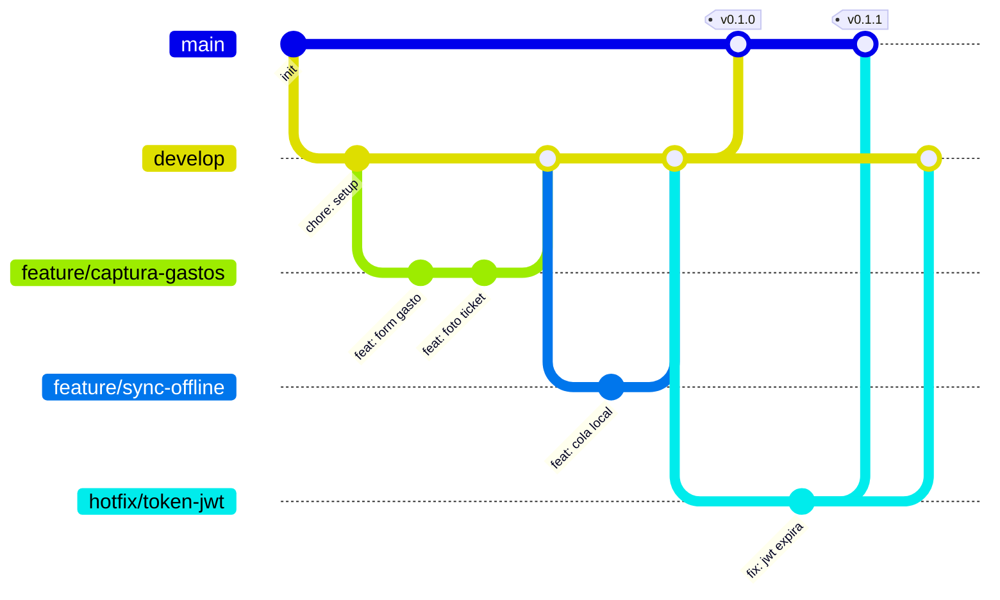

# Workflow de versionamiento — Comparación y elección

## 1. Cuadro comparativo

| Criterio | GitHub Flow | Gitflow | Trunk-Based Development |
|---|---|---|---|
| Ramas permanentes | Solo `main` | `main` + `develop` | Solo `main`/`trunk` |
| Ramas de apoyo | `feature/*` (corta vida) | `feature/*`, `release/*`, `hotfix/*` | Ramas muy cortas (horas) o commits directos con feature flags |
| Curva de aprendizaje | Baja | Media-alta | Media (requiere disciplina de flags/CI fuerte) |
| Apto para releases programados (Sprints) | Parcial | **Sí**, muy natural (rama `develop` = integración del Sprint) | No directamente, requiere feature flags para ocultar trabajo incompleto |
| Riesgo de romper `main`/producción | Bajo (si CI es estricto) | Muy bajo (`main` solo recibe código ya integrado en `develop`) | Depende 100% de CI + feature flags, si fallan el riesgo es alto |
| Tamaño de equipo recomendado | Pequeño-mediano | Pequeño-mediano, con Sprints definidos | Equipos con CI/CD muy maduro |
| Encaja con nuestro contexto (equipo de 4, Sprints semanales, app offline-first con releases por hito) | Parcial | **Alta** | Baja (exige infraestructura de flags/CD que no tenemos aún) |

## 2. Justificación

Elegimos **Gitflow ligero** porque el proyecto se organiza en **Sprints semanales con entregas verificables** (Sprint Review), y Gitflow modela exactamente eso: `develop` acumula el trabajo integrado del Sprint en curso, mientras `main` solo recibe código ya validado al cierre de cada Sprint, generando un tag semántico. Esto da un punto de "estado siempre estable" en `main` que sirve tanto para la evaluación de la materia como para futuras distribuciones (Firebase App Distribution/Play Store). GitHub Flow sería más simple, pero al no tener una rama de integración intermedia, cada `feature/*` tendría que apuntar directo a `main`, lo que complica separar "lo que ya se probó en conjunto" de "lo que ya es oficialmente estable para publicar". Trunk-Based Development ofrece integración aún más continua, pero exige una cultura de *feature flags* y un pipeline de CI/CD mucho más maduro del que tenemos como equipo de 4 personas en un curso — es una opción a la que podríamos migrar más adelante (de hecho ya usamos un feature flag puntual, ver `docs/estrategia-despliegue-movil.md`), pero no como base de todo el flujo.

## 3. Diagrama de ramas

*(Este diagrama se renderiza automáticamente en GitHub al ver el archivo. También puede abrirse en [Mermaid Live Editor](https://mermaid.live) para exportarlo como imagen si se necesita para el documento entregable.)*
